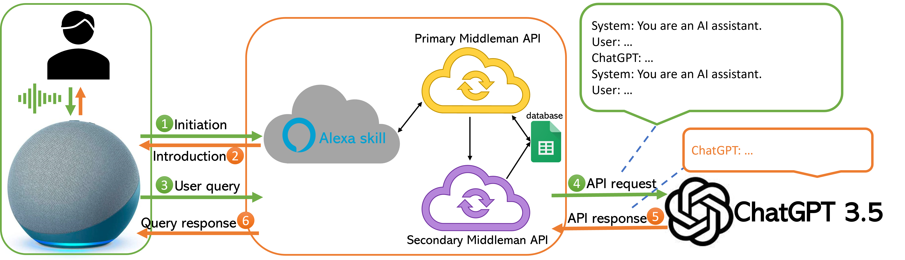
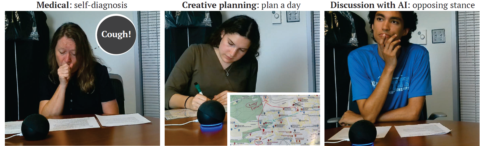

## Background
Conventional voice assistants (VAs) suffer from the limitations of unable to understand contextual information (respond to follow-up questions), unable to understand complex commands, and intolerant to errors such as mistranscriptions. Large language models (LLMs) serve as a good tool to overcome these limitations, but existing platforms for LLMs are all text-based. We are therefore interested in exploring the effect of using LLMs as a voice-based platform in the form of a VA. This work is currently under review[^fn1].

[^fn1]: Amama Mahmood, Junxiang Wang, Bingsheng Yao, Dakuo Wang, and Chien-Ming Huang. “[LLM-powered conversational voice assistants: interaction patterns, opportunities, challenges, and design guidelines.](https://arxiv.org/pdf/2309.13879.pdf)” *Under review*. 

## System structure
We used Amazon Alexa as our VA platform, and incorporated ChatGPT 3.5 as the backend LLM through an Alexa skill and middleman API's. A system structure diagram is shown below.

## User study
We designed a user study where the participant would use the LLM-based interface to complete three different tasks:
1. **Medical**: Given a list of symptoms, the participant is asked to self-diagnose in five different aspects.
2. **Creative planning**: Given a map of a section of a city, the participant is asked to plan a day of tourism.
3. **Discussion with AI**: Given a topic, the participant would present their stance, and the VA would always be in opposition of the stance to continue the discussion. 

We extracted different interaction patterns from the recorded videos, and demonstrated that our LLM-powered VA is able to facilitate smoother, more human-like interaction compared to conventional VAs.
